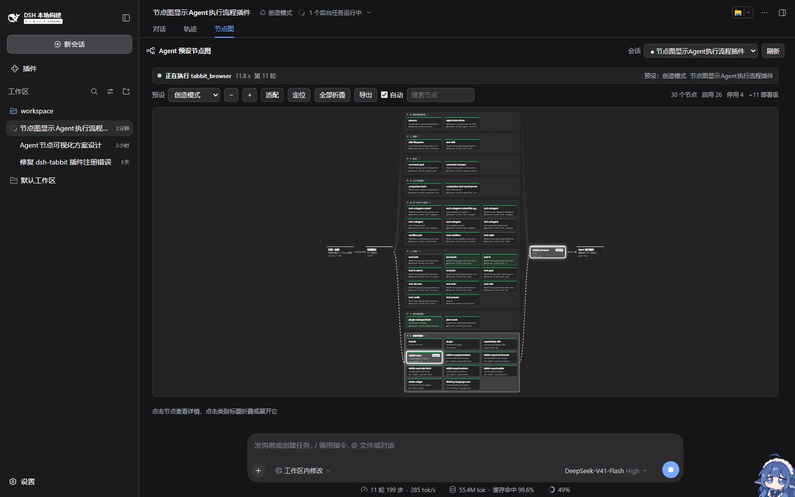
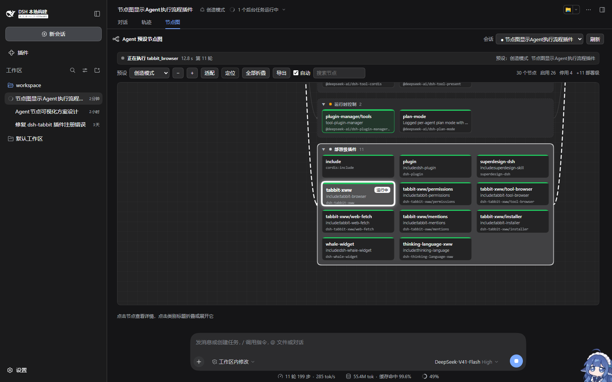
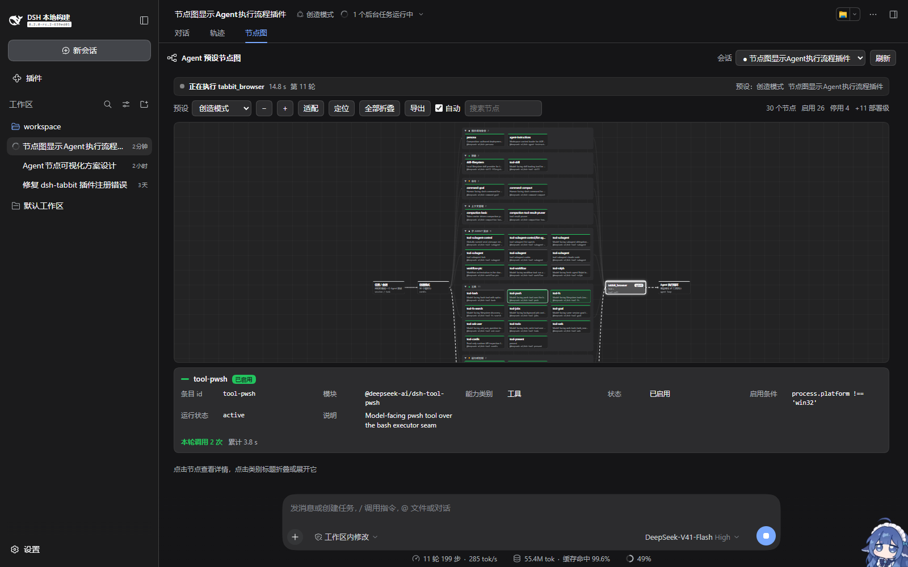
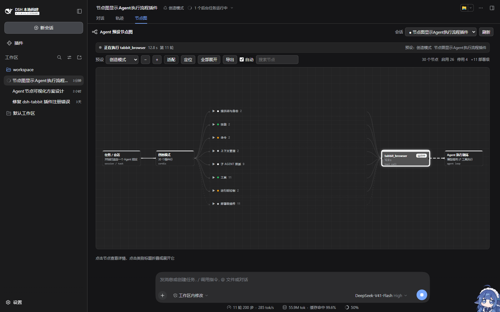
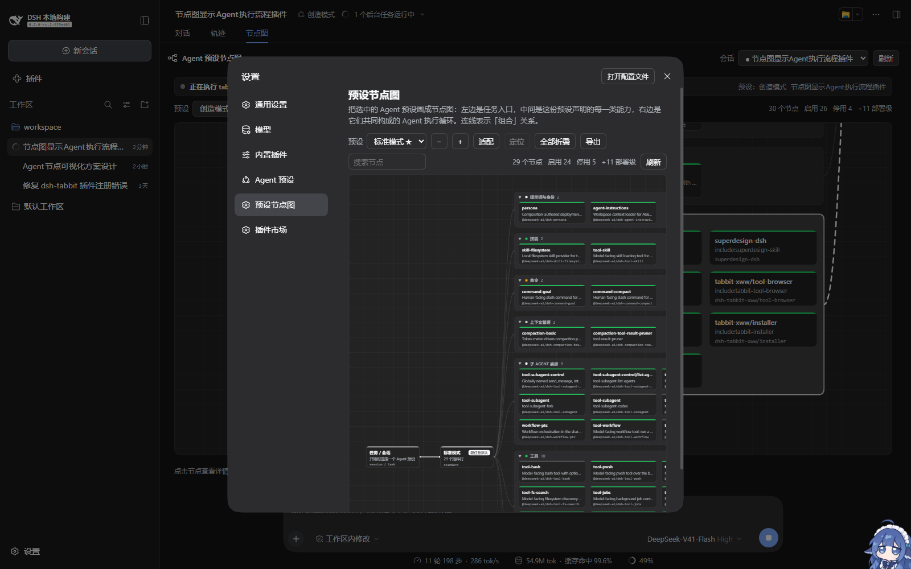

# agent-preset-graph-xww

[](./LICENSE)
[](https://github.com/deepseek-ai)

Draws an **Agent preset** as a ComfyUI-style node graph, and highlights live which node the Agent is working through right now.

In DeepSeek Harness an agent preset is really a plugin manifest — it decides which tools the Agent gets, what skills it carries, whether it may delegate to sub-agents. Until now that manifest was only readable as YAML. This plugin draws it: the task entry on the left, every capability category the preset declares in the middle, and the Agent loop they compose on the right.



---

## What it looks like

Open any session and the tab strip grows a third tab: `Chat | Trajectory | Graph`.

The graph reads left to right as one pipeline:

```
Task/Session → Preset → [capability frames] → Current call → Agent loop
```

- **Capability frames** group the preset's plugins by package prefix (prompt & identity, skills, commands, context management, sub-agent delegation, tools, runtime control, other). Each plugin is a node card showing its short name, entry id, module and enablement.
- **Deployment plugins** is a separate frame for bundles this profile mounts that the preset does **not** declare. It is wired with dashed edges: callable, but not the preset's to hand out.
- **Current call** is the Agent's working edge — the running tool lands here with its name and a live timer.
- Edges mean "composes".

## Live highlighting

The bar on top answers four questions: **what is running · for how long · which turn · which preset this session uses**.



Three layers appear on the canvas at once:

| Layer | Meaning |
|---|---|
| **Strong border, glow, "Running" badge** | the node executing right now |
| **Flowing dashed edge** | the path the work travels (preset → its category frame → current call → Agent loop) |
| **Soft green** | nodes this turn has already walked, so a long turn reads as a path |

Tool names map to nodes in two steps: shipped tools via a built-in table (`pwsh → tool-pwsh`, `edit/read → tool-fs`, …), anything else by fuzzy-matching the tool name against plugin names (`tabbit_browser → dsh-tabbit-xww`). When neither matches, the highlight falls back to the **Current call** node while the bar states the tool verbatim — so something on the canvas always lights up while a tool runs.

## Node detail

Click a node and its full record opens below; click empty canvas and it folds away, handing the space back to the graph.



Besides entry id, module, category, enablement condition and runtime state, the panel adds **this-turn statistics**: how many times the node was called, the total time it took, and how many calls are still in flight.

## Fold it into an outline

Category titles fold individually, or the toolbar folds them all at once — 45 nodes collapse into a single outline:



Toolbar: `Preset · − · + · Fit · Locate · Fold/Expand all · Export · ☑Auto · Search · Stats`

- **Locate** jumps back to the running node after you have panned away. Auto-follow never fights you: it only moves when the work moves to a different node.
- **Auto** (on by default) follows the running node at 1:1.
- **Search** filters by title, module or entry id.
- **Export** writes the current graph as a 2× PNG, handy for pasting into an issue.

## Browsing surface in Settings

`Settings → Preset graph` is the same canvas as a static browser over every declared preset. It follows the host theme in light and dark.



---

## Install

The plugin installs into a DSH **profile**. Edit `package.json` inside your profile directory (`$DSH_HOME/profiles/<name>/`):

```json
{
  "dependencies": {
    "agent-preset-graph-xww": "github:OWNER/agent-preset-graph-xww"
  },
  "dsh": {
    "profile": {
      "bundles": [
        "@deepseek-ai/dsh-base",
        "@deepseek-ai/dsh-web-app",
        "agent-preset-graph-xww"
      ]
    }
  }
}
```

Then run `pnpm install` in the profile directory and restart DSH.

For local development, point at a working copy instead:

```json
"agent-preset-graph-xww": "link:D:/path/to/agent-preset-graph-xww"
```

### Uninstall

Remove the entry from both `dependencies` and `dsh.profile.bundles`, then `pnpm install`.

---

## How it works

The plugin is client-only (browser half), has **no build step**, and imports no Harness client package. Everything comes from services DSH already exposes:

| Data | Source |
|---|---|
| Each preset's plugin list | `ctx.remote.pluginInventory.list()` → `agentPresets[].rows[]` |
| Every plugin the profile mounts | the same call's `entries[]` |
| Which preset the session runs | `projectionValues.agentPreset` on the `ctx.sessions.list` snapshot |
| What tool is executing | the event window from `ctx.sessions.retain()` (`tool/call` / `tool/result`) |
| Copy and preset names | `ctx.locale` |

A few deliberate choices:

- **"Deployment plugins"** means: not in the `@deepseek-ai/` namespace, enabled, and absent from the current preset's rows. That filters out the ~200 entries DSH ships with.
- **Capability categories are inferred from package prefixes**, not an official DSH taxonomy — the UI says so too.
- **PNG export adds no dependency**: the same layout is redrawn as standalone SVG and rasterised through a canvas. Theme colours are resolved from CSS variables via a hidden probe element, so dark and light both export correctly.
- **Styling uses only `--dsw-alias-*` theme tokens**, which is why it follows the host theme and locale.

## Known limitations

- The tool→node table covers DSH's shipped tools; third-party tools rely on fuzzy name matching and fall back to the Current-call node when the name has nothing in common with the package.
- Preset composition arrives **flattened** from the Plugin Inventory, so Loader group nesting is not reflected in the graph.
- Statistics cover the **current turn**; calls older than the retained event window are not counted.

## Development

No build step — edit `client.js` and refresh (when the profile installs it via `link:`).

```bash
node --check client.js     # the only check there is
```

- `client.js` — everything: graph building, layout, live state, rendering, export
- `index.js` — Host half; it only gives the bundle a Loader row
- `cordis.patch.yml` — mounts the bundle into the Loader

## License

[MIT](./LICENSE)
